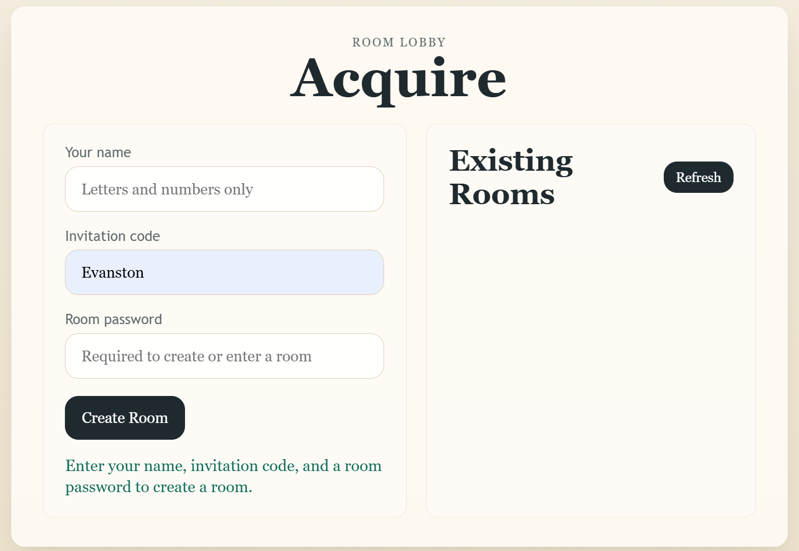
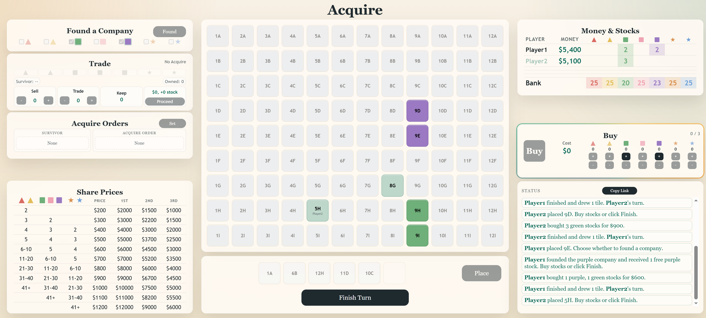

# Acquire Board Game





This repository is a private, browser-based multiplayer board game inspired by hotel-merger gameplay. It is intentionally small:

- Python `Flask` backend
- WebSocket updates with `Flask-SocketIO`
- Plain `HTML`, `CSS`, and `JavaScript` frontend
- In-memory room state
- Turn-based shared board with tile dealing

Current features include:

- use a lobby page to create, join, or spectate a password-protected room
- list active rooms and the players waiting in each room
- validate player names as 1-10 letters or numbers
- prevent duplicate player names within a room
- offer Classic rooms for 2-5 players and Expanded rooms for 2-8 players
- allow only the room creator to start the game
- move players and waiting spectators to the board page after start
- show all player tiles in a read-only spectator interface
- show a live list of connected spectators on the board page
- place tiles on a 9x12 Classic board or an 11x14 Expanded board
- push room updates instantly with WebSockets
- found companies and expand company groups
- buy up to 3 stocks after tile placement resolves
- resolve acquisitions with survivor/order choices for tied company sizes
- pay shareholder rewards during acquisitions and final scoring
- sell, trade, or keep stocks after an acquired company is resolved
- detect invalid tiles that would connect two super companies
- show final rankings with a closable score panel

## 1. Run locally

Open PowerShell in this folder and run:

```powershell
python -m venv .venv
.venv\Scripts\Activate.ps1
pip install -r requirements.txt
python app.py
```

Then open:

```text
http://127.0.0.1:5050
```

### Create a room

Enter the fields on the left side of the lobby:

1. Your player name (1-10 letters or numbers)
2. Invitation code: `evanston`
3. A room password of your choice
4. A game mode:
   - **Classic**: 2-5 players on the original 9x12 board
   - **Expanded**: 2-8 players on an 11x14 board

Click **Create Room**. The new room appears under **Existing Rooms** with its mode, board size, and capacity. The creator cannot Join or Spectate their own room; after at least 2 players have joined, the creator clicks **Start Game**.

### Join a room

Joining does not require the invitation code. Enter your name at the left, enter the room password inside the desired room card, and click **Join**. You will wait in the lobby until the creator starts the game.

### Spectate a room

Spectating also requires only your name and the room password. Click **Spectate** on the desired room. You will wait in the lobby and automatically move to the read-only game interface when the creator starts.

The room disappears from **Existing Rooms** when no players are connected. Spectators do not keep a room alive.

## 2. What the files do

- `app.py`: backend routes and in-memory game state
- `templates/index.html`: main page
- `templates/game.html`: board page
- `static/style.css`: page styling
- `static/app.js`: lobby logic and WebSocket updates
- `static/game.js`: board-page logic and WebSocket updates
- `requirements.txt`: Python packages for local use and Render

## 3. Push to GitHub

Create an empty repository on GitHub first. GitHub's docs say not to initialize it with extra files if you are pushing an existing local project.

Then run:

```powershell
git init
git add .
git commit -m "Initial multiplayer prototype"
git branch -M main
git remote add origin https://github.com/YOUR-USERNAME/YOUR-REPO.git
git push -u origin main
```

## 4. Deploy to Render

Create a `Web Service` on Render, not a static site, because this app has a Python backend.

Use these settings:

- Language: `Python 3`
- Build Command: `pip install -r requirements.txt`
- Start Command: `gunicorn -w 1 --threads 100 --timeout 0 --keep-alive 75 app:app`
- Health Check Path: `/health`
- Instances: `1`

After deployment, Render will give you an `onrender.com` URL. Share that URL with your friend.

This repo also includes `render.yaml`, so you can deploy it as a Render Blueprint instead of typing the settings manually.

## 5. Important limitation

Right now the game state is stored only in server memory. That means:

- restarting the service clears all rooms
- free-tier spin-down can clear active state
- running more than one web instance will split game state across instances, so keep Render at `1` instance
- no saved games yet

For a real version, the next steps are:

1. move room state into a database
2. add saved games
3. add private invite links and reconnection support
4. add stronger production monitoring and persistence
